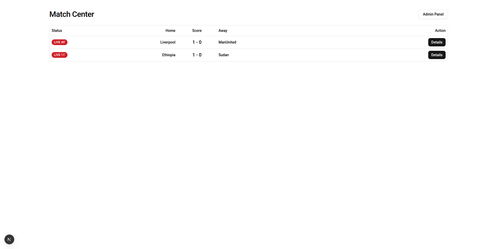
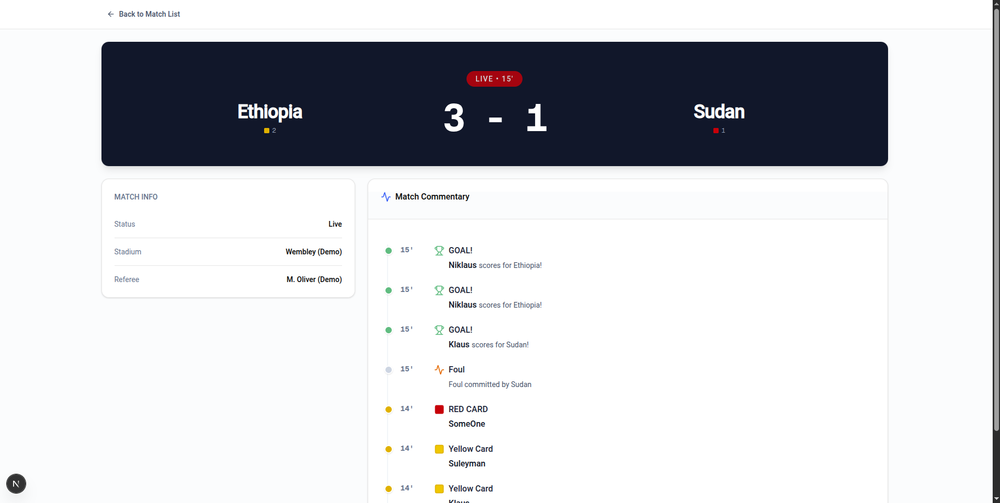
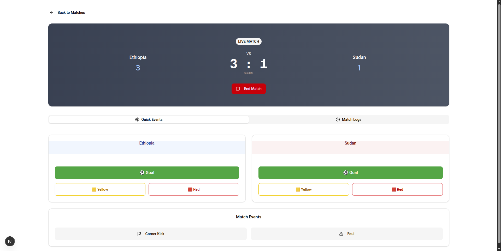

# ⚽ Football Match Tracker

A real-time football score broadcasting system built with **Express.js** (Backend) and **Next.js** (Frontend). It uses **Server-Sent Events (SSE)** to push live updates (goals, cards, timers) to users instantly without refreshing the page.

## 🚀 Features

- **Real-Time Updates:** Scores and logs update instantly using Event Streams.
- **Live Match Timer:** Dynamic game clock tracking (e.g., 45', 90+4').
- **Admin Dashboard:** Full control to create matches, start games, and trigger events.
- **Event Details:** Track Goals (with scorers), Yellow/Red Cards, Corners, and Fouls.
- **Modern UI:** Built with **Shadcn UI** & **Tailwind CSS** for a professional look.

---

## 📸 Demo & Screenshots

### 🎥 Video Demo
> *Watch the system in action: Admin triggering a goal -> User UI updating instantly.*


*(Replace `demo-video.gif` with your actual video file or a link to Loom/YouTube)*

### 🖼️ Screenshots

**1. Live Match Board (Home Page)**
*Shows all live, upcoming, and finished matches.*


**2. Match Details View**
*Real-time commentary logs, live score, and match statistics.*


**3. Admin Control Panel**
*Interface to manage teams and send live events.*


---

## 🛠️ Tech Stack

- **Frontend:** Next.js (App Router), TypeScript, Tailwind CSS, Shadcn UI, Axios.
- **Backend:** Node.js, Express.js, Server-Sent Events (SSE).
- **Data:** In-memory storage (for simplicity and speed).

---

## ⚡ Getting Started

Follow these steps to run the project locally.

### 1. Clone the Repository
```bash
git clone https://github.com/your-username/football-match-tracker.git
cd football-match-tracker
